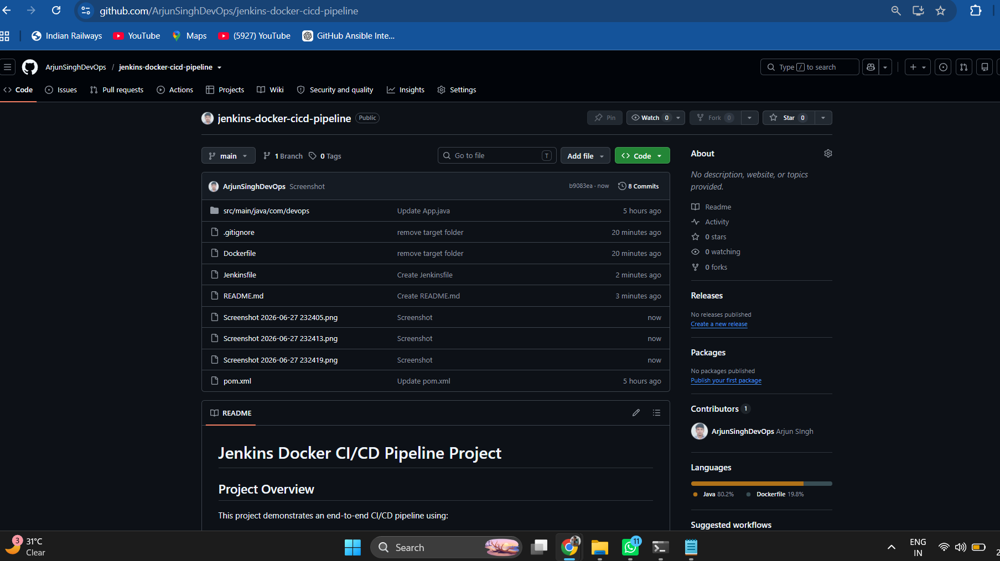
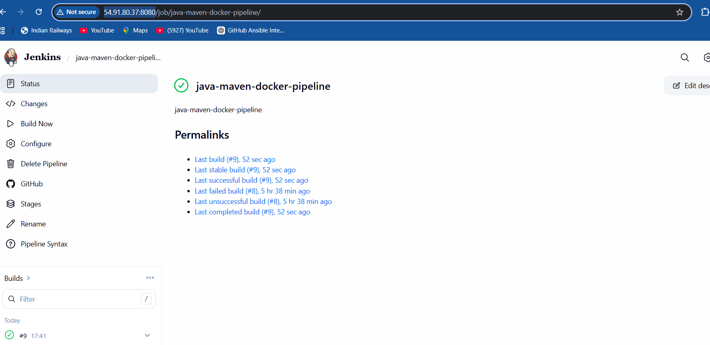
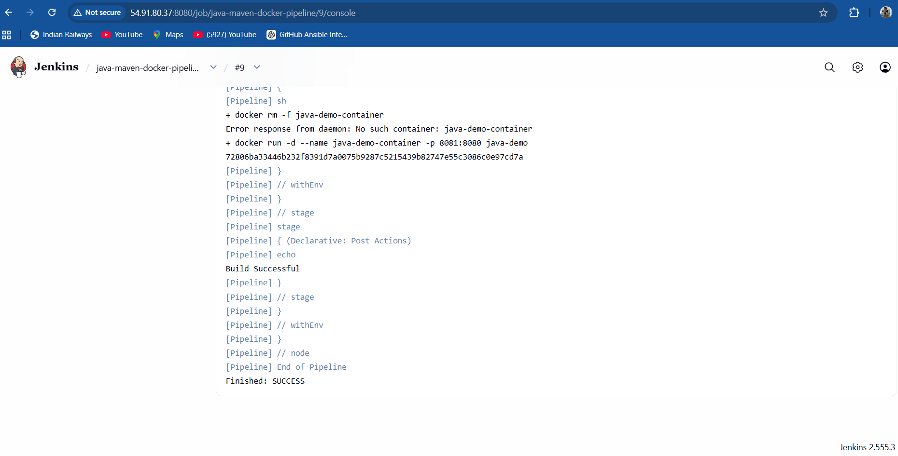
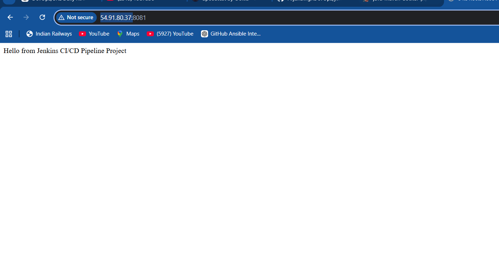

# 🚀 Jenkins Docker CI/CD Pipeline Project

## 📌 Project Overview

This project demonstrates an end-to-end CI/CD pipeline using:

- Jenkins
- Maven
- Docker
- Java Spring Boot
- AWS EC2
- Git & GitHub

The pipeline automatically:

1. Pulls source code from GitHub
2. Builds the application using Maven
3. Creates a Docker image
4. Deploys the container on AWS EC2
5. Makes the application accessible via browser

---

## 🏗️ Project Architecture

```text
GitHub
   |
   v
Jenkins Pipeline
   |
   v
Maven Build
   |
   v
Docker Build
   |
   v
Docker Container
   |
   v
AWS EC2 Deployment
```

---

## 📂 Project Structure

```text
.
├── src
├── Dockerfile
├── Jenkinsfile
├── pom.xml
├── README.md
├── .gitignore
└── screenshots
```

---

# 📷 Screenshots

## 1️⃣ GitHub Repository



---

## 2️⃣ Jenkins Pipeline Successful Build



---

## 3️⃣ Jenkins Console Output



---

## 4️⃣ Application Running on AWS EC2



---

# ⚙️ Jenkins Pipeline

```groovy
pipeline {
    agent any

    tools {
        maven 'maven'
    }

    stages {

        stage('Checkout') {
            steps {
                git 'https://github.com/ArjunSinghDevOps/jenkins-docker-cicd-pipeline.git'
            }
        }

        stage('Build') {
            steps {
                sh 'mvn clean package'
            }
        }

        stage('Docker Build') {
            steps {
                sh 'docker build -t java-demo .'
            }
        }

        stage('Deploy') {
            steps {
                sh 'docker rm -f java-demo-container || true'
                sh 'docker run -d --name java-demo-container -p 8081:8080 java-demo'
            }
        }
    }
}
```

---

# 🚀 Application URL

```
http://YOUR_EC2_PUBLIC_IP:8081
```

Example:

```
http://54.91.80.37:8081
```

---

# 🛠️ Technologies Used

- Jenkins
- Maven
- Docker
- Java
- Spring Boot
- Git
- GitHub
- AWS EC2

---

# 👨‍💻 Author

**Arjun Singh**

DevOps Engineer | Product Support Engineer | AWS | Docker | Jenkins
